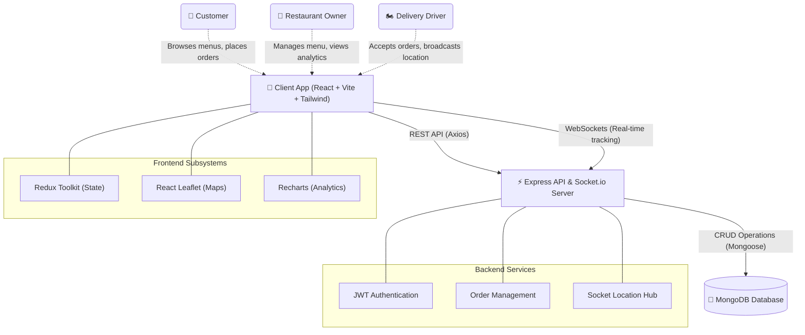

# 🍔 Food Delivery Platform

A modern, highly-interactive full-stack food delivery application built with the MERN stack. It features three distinct user roles, real-time live map tracking, secure authentication, and a powerful owner analytics dashboard.

## 🌟 Key Features

- **Multi-Role System**: Dedicated, responsive interfaces for Customers, Restaurant Owners, and Delivery Drivers.
- **Real-Time Live Tracking**: Integrated Socket.io and Leaflet Routing Machine for precise, real-time map routing between the restaurant and the delivery location.
- **Owner Dashboard & Analytics**: Interactive charts built with Recharts to visualize daily revenue trends and order status distributions.
- **Precision Mapping**: Drops pins to capture exact geographical coordinates (`lat`, `lng`) for both restaurants and customers to enable 100% accurate routing.
- **Secure Authentication**: JWT-based authentication utilizing HTTP-only cookies.
- **State Management**: Redux Toolkit for seamless global state handling across complex UI flows.

## 🏗️ Architecture Diagram



## 🛠️ Technology Stack

**Frontend:**
- React 19 (Vite)
- Tailwind CSS v4
- Redux Toolkit
- React Router DOM
- React-Leaflet & Leaflet Routing Machine
- Socket.io-client
- Recharts

**Backend:**
- Node.js & Express.js
- MongoDB & Mongoose
- Socket.io (Real-time communication)
- JSON Web Tokens (JWT) & bcrypt (Security)
- Cookie-parser

## 🚀 Getting Started

### Prerequisites
- Node.js installed
- MongoDB database (local or Atlas)

### Installation

1. **Clone the repository:**
   ```bash
   git clone <your-repo-url>
   ```

2. **Setup Backend:**
   ```bash
   cd backend
   npm install
   ```
   Create a `.env` file in the `backend` directory:
   ```env
   PORT=8000
   MONGODB_URL=your_mongodb_connection_string
   JWT_SECRET=your_secret_key
   EMAIL_USER=your_email_address
   EMAIL_PASS=your_email_app_password
   EMAIL_HOST=smtp.gmail.com
   EMAIL_PORT=587
   EMAIL_SECURE=false
   FRONTEND_URL=http://localhost:5173
   ```
   Start the backend server:
   ```bash
   npm run dev
   ```

3. **Setup Frontend:**
   ```bash
   cd frontend
   npm install
   ```
   Create a `.env` file in the `frontend` directory:
   ```env
   VITE_SERVER_URL=http://localhost:8000
   VITE_API_URL=http://localhost:8000
   ```
   Start the frontend server:
   ```bash
   npm run dev
   ```

4. **Launch Application**:
   Navigate to `http://localhost:5173` in your browser.
